Site Link Analyzer
==================================================

[](https://badge.fury.io/rb/sla)
[](https://github.com/DannyBen/sla/actions?query=workflow%3ATest)
[](https://codeclimate.com/github/DannyBen/sla/maintainability)

---

SLA is a simple broken links checker, with built in caching.



Install
--------------------------------------------------

```
$ gem install sla
```


Features
--------------------------------------------------

- Easy to use command line interface.
- Built in caching, to avoid overtaxing the server.
- Show and save list of broken links to a log file.
- Exits with non zero code on failure, for CI integration.


Usage
--------------------------------------------------

```
$ sla --help
Site Link Analyzer

Usage:
  sla URL [options]
  sla --help | -h | --version

Options:
  --verbose, -v
    Show detailed output

  --simple, -s
    Show simple output of errors only

  --depth, -d DEPTH
    Set crawling depth [default: 5]

  --external, -x
    Also check external links

  --ignore, -i URLS
    Specify a list of space delimited patterns to skip
    URLs that contain any of the strings in this list will be skipped

  --cache, -c LIFE
    Set cache life [default: 1d]. LIFE can be in any of the following formats:
      10  = 10 seconds
      20s = 20 seconds
      10m = 10 minutes
      10h = 10 hours
      10d = 10 days

  --cache-dir DIR
    Set the cache directory

  -h --help
    Show this help

  --version
    Show version number

Parameters:
  URL
    URL to scan

Environment Variables:
  SLA_SLEEP
    Set number of seconds to sleep between calls (for debugging purposes)

Examples:
  sla example.com
  sla example.com -c10m -d10
  sla example.com --cache-dir my_cache
  sla example.com --depth 10
  sla example.com --cache 30d --external
  sla example.com --simple > out.log
  sla example.com --ignore "/admin /customer/login"

```
